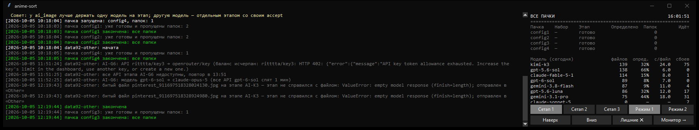
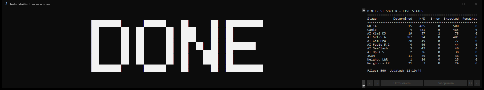

# anime-sort

A config-driven Windows pipeline that sorts a large anime-art collection (≈40,000 Pinterest pins) into
`Title\Character` folders. Each image goes through a chain of "identifiers": local ONNX taggers first,
then multimodal LLMs, then text-only metadata analysis and finally neighbour heuristics. Every stage only
sees the images that the previous ones could not identify, so the expensive models touch just a few percent of the data.



## Features

- **Pipeline as configuration.** Stages, their order, models, confidence thresholds and which images each stage
  receives (`"from": 0.10`, `"where": "[AI-GF] and [AI-K3]"`) are described in JSON. No code changes are needed
  to try a new model or reorder the chain. Configs are validated up front, and errors point to the line with a suggested fix.
- **Multi-provider failover.** Any stage can list several OpenAI-compatible APIs. A key with an exhausted balance is
  switched immediately. A key that keeps failing (network errors, 5xx, a model that "rattles" with empty or garbage answers)
  is put to sleep and re-checked later. A gateway that silently drops images is detected and skipped.
  Answers are cached per model, so restarts and key switches never pay twice.
- **Fallback models.** Every AI stage can name a spare model with its own routes. If all routes of the stage sleep
  longer than `after` minutes (the model "hangs" at every provider), the stage switches to the spare model and the
  stage table shows its name. Spare routes are cross-provider: first another model of the same gateway, then another gateway.
- **Parallel batches.** Several batches run at once. `prepare.bat` probes every key and model with a tiny request
  (works / no balance / loses images / no key), decides how many batches to run and generates their configs from a
  template. Each batch gets a different primary key, and with `"rotate_ai": true` a different **order of AI stages**,
  so simultaneous batches sit on different models and providers. Routes that do not work right now are kept at the
  end of the list, so a topped-up provider is picked up without re-running `prepare`.
- **Config agent.** An optional LLM agent (OpenRouter, its own key) surveys every key × model and the account
  balances, then rebuilds the templates under the owner's rules (no model repeated across AI stages, a second
  provider for every stage, cheap models first, ≥ 5 AI stages for the second pass…). Its answer is built and
  validated exactly like real configs before anything is written, and validation errors go back to the agent.
- **Second pass for hard images.** Everything that ended up in "Other" is moved into `dataN-other` batches and
  processed by a separate template with six AI stages. Neighbour stages there look at the **global** save order
  across all datasets: each file is located by its SHA-256 among the manifests of the original batches.
- **Robust to the real world.** Unreadable files, files a model consistently fails on and processes that crash on the
  same image are marked as broken and routed to "Other", so a dataset can always finish. Every run resumes where it stopped.
- **Live UI (Tkinter).** One window per dataset with a colour log and a stage table, plus a main window with statistics
  (per batch, per model, per API). It also has window "setups" (sizes and fonts), arrangement modes over multiple monitors,
  and z-order controls. Each dataset window can steer its own pipeline: **←** go back to the previous stage (only for
  files neither stage has touched), **→** skip a stalled stage, **↻** re-check sleeping APIs now (e.g. after a top-up),
  **↔** force the next provider.


- **Collection tools.** Merge finished datasets into the collection with hash-based de-duplication, rename folders by
  rules, number folders by size, and a watcher that keeps numbering live. An **LLM agent** (OpenRouter only, separate key)
  finds duplicate titles and characters written in different languages or styles and proposes rules for `names.json`.

## How it works

```mermaid
flowchart LR
    A[dataN<br/>500 images] --> B[WD-14 / Camie<br/>local ONNX taggers]
    B -->|not identified| C[Gemini Flash<br/>image]
    C -->|not identified| D[Kimi K3<br/>image]
    D -->|both unsure| E[Claude / GPT<br/>image, expensive]
    E -->|still unknown| F[Pin text<br/>LLM over metadata]
    F --> G[Neighbours<br/>same title around]
    G --> H[test-dataN/out<br/>Title/Character]
    H -->|finish.bat| I[(Waifu collection)]
```



| Stage type | What it uses |
|---|---|
| `wd14`, `camie` | Local ONNX taggers (danbooru tags) mapped to titles and characters |
| `ai_image` | Multimodal LLM over the image (plus embedded pin text), JSON answer with confidence |
| `json_meta` | Text-only LLM over the pin title and description, cross-checked with a catalog of the collection |
| `neighbors_*` | Pins saved next to each other on a board usually belong to the same title (in `dataN-other` — by the global save order) |

## Quick start

Requirements: Windows 10/11 and Python 3.12.

```bat
py -3.12 -m venv venv
venv\Scripts\pip install -r requirements.txt
```

1. Copy `secrets.example\` to `secrets\` and put your API keys there (one key per file). Keys are never committed.
2. Copy `configs\config.example.json` to `configs\config.json` and set `"collection"`. It is the folder with
   `anime-paths.json`, the shared path file with the companion data tool.
3. Describe the stages and candidate keys in `configs\template.json` (and `template-other.json` for the second pass).
4. Run `prepare.bat`. It first offers the config agent (paid, optional), then checks the keys, finds unprocessed folders,
   writes the batch configs and offers to start.
5. When batches finish, run `finish.bat`. It merges results into the collection, dissolves tiny titles (≤ 15 images:
   characters known in a big title move there, the rest goes to "Other") and renumbers folders.
6. Optionally run `other.bat` to send everything from "Other" to the second pass. The names agent is run on demand:
   `venv\Scripts\python tools\agent\names_agent.py`.

| Launcher | Purpose |
|---|---|
| `prepare.bat` | Probe APIs, plan batches, generate `configN.json`, start |
| `start.vbs` | Start the batches listed in `config.json` → `run` |
| `finish.bat` | Post-processing (merge, tidy, renumber) with retry / skip on errors |
| `other.bat` | Move everything from "Other" to a second pass (`dataN-other`, `template-other.json`) |

## Project layout

```
engine/      config validation, batch/dataset runners, API client with failover, window layout, folder marks
stages/      one module per stage type
gui/         dataset window, main window, statistics
tools/       collection tools: add (merge), fix_name (+ regroup), sort, watch, agent, cleanup, prepare/finish/other
configs/     template.json, template-other.json, config.json, live.json (hot-reloaded), agent.json, tools.json
providers/   OpenAI-compatible providers (endpoint + model names); keys live in secrets/
tests/       pytest suite for the pure logic
docs/        architecture notes and screenshots
```

See [docs/architecture.md](docs/architecture.md) for the design in detail. Every folder also has a README in Russian
(the author's working language).

## Development

```bat
venv\Scripts\pip install -r requirements-dev.txt
venv\Scripts\ruff check .
venv\Scripts\pytest
```

CI runs ruff and pytest on `windows-latest`, because the window layout uses Win32 APIs.

## License

MIT
